# Hacking with GDB

## Compiling the Code

Now, first we'd like to describe some details about a simple but instructive C program to you. For simplicity, we name it _**overflow**_.

_overflow.c_:


```c
#include<stdio.h>
#include<string.h>
#include<stdlib.h>
void granted();
int checkPasswd();
int checkPasswd()
{
    char passwd[16];
    printf("Enter your passwd: ");
    gets(passwd);
    if(strcmp(passwd, "passwd1"))
    {   
        printf("\nYou fail!\n");
    }   
    else
    {   
        granted();
    }   
}
void granted(){
    printf("\nAccess granted\n");
    printf("You have gotten the privileges, and can do anything you like!! ");
    // Privileged stuff happens here.
    return ;
}
int main(){
    checkPasswd();
    return 0;
}
```


In _overflow.c_, the `main()` function invokes the `checkPasswd()` function. In `checkPasswd()` function, if the password we enter is correct, it will invoke the `granted()` function and we will get the privileges to do anything. Of course, we have not set any privileged stuff here, it just prints out a statement to denote that you have been granted access. Then compile the source code:

```
$ gcc -m32 -g -fno-stack-protector -no-pie overflow.c -o overflow
```

To prevent the program from stack buffer overflow attacks, GCC (>=5.4.0) enables the option `fstack-protector` by default. So, to demonstrate how to hack with stack buffer overflow, we specify `-fno-stack-protector` disabling the stack protector, and here, we forbid the PIE (Position-Independent Executable).&#x20;

Also, we see that the given system is a 64-bit one, but this lab is in the 32-bit environment, so we add '`-m32`' option to deal with this issue. Remember that you are required to install "`gcc-multilib`, `g++-multilib`, `libc6-dev-i386`, `libc6:i386`, and `gdb-multiarch`" by simple "`apt-get install`", and you can check this when later doing gdb hacking by using "`show architecture`" and "`set architecture i386`" commands to make sure that.

Then, we will see this warning information:

<figure>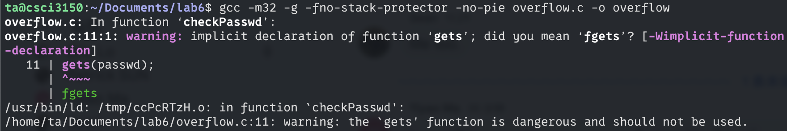<figcaption><p>warning</p></figcaption></figure>

Here is a quote from `man gets`.

> The gets() function cannot be used securely. Because of its lack of bounds checking, and the inability for the calling program to reliably determine the length of the next incoming line.

Yes, just as you guessed, we will make use of the dangerous `gets()` function to hack the _**overflow**_ program.

When we enter the correct password(note that we hardcode the correct password in _overflow.c_):

<figure><figcaption><p>Correct Passwd</p></figcaption></figure>

When we enter a wrong password:

<figure><figcaption><p>Wrong Passwd</p></figcaption></figure>

## Procedure and Stack

Before we start to hack, it will be better for us to review the knowledge about the Linux stack. Linux stack is similar to what Eric introduced during the lecture, but we will describe some details with assembly instructions.

A procedure call involves passing both data (in the form of procedure parameters and return values) and control from one part of a program to another. In addition, it must allocate space for the local variables of the procedure on entry and deallocate them on exit. Most machines, including IA32, provide only simple instructions for transferring control to and from procedures. The passing of data and the allocation and deallocation of local variables are handled by manipulating the program stack.

### Stack Frame Structure

IA32 programs make use of the program stack to support procedure calls. The machine uses the stack to pass procedure arguments, store return information, and save registers for later restoration, and for local storage. The portion of the stack allocated for a single procedure call is called a stack frame. We should pay attention to that in Linux **the stack is growing from a high memory address to a low memory address** just as follows:

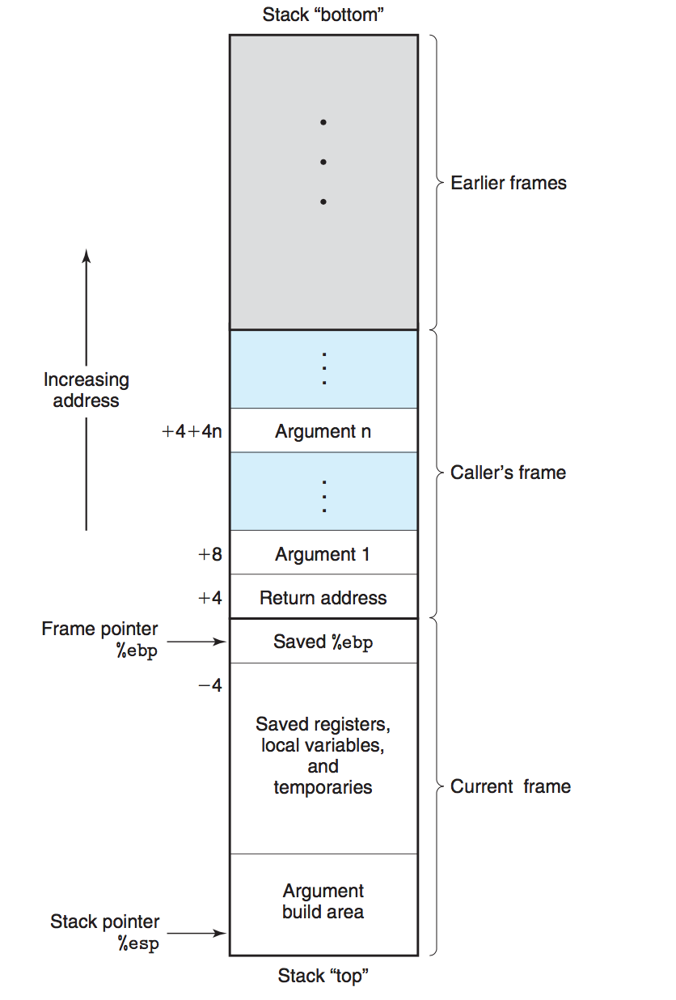

The topmost stack frame is delimited by two pointers, with register %ebp serving as the frame pointer, and register %esp serving as the stack pointer. The stack pointer can move while the procedure is executing, and hence most information is accessed relative to the frame pointer. Suppose procedure P (the caller) calls procedure Q (the callee). The arguments to Q are contained within the stack frame for P. In addition, when P calls Q, the **return address** within P where the program should resume execution when it returns from Q is pushed onto the stack, forming the end of P’s stack frame. The stack frame for Q starts with the saved value of the P's frame pointer, followed by copies of any other saved register values. Procedure Q also uses the stack for any local variables that cannot be stored in registers. As described earlier, the stack grows toward lower addresses, and the stack pointer %esp points to the top element of the stack. Data can be stored on and retrieved from the stack using the push and pop instructions. **Space for data with no specified initial value can be allocated on the stack by simply decrementing the stack pointer %esp by an appropriate amount**. Here we shall help you review these two stack operation instructions with two examples:

* _push_: pushing a double-word value onto the stack involves first decrementing the stack pointer(%esp) by 4 and then writing the value at the new top of the stack address.
* _pop_: popping a double-word value involves reading from the top of the stack location and then incrementing the stack pointer by 4.

### Transferring Control

Here, we mainly review two very important instructions.

* _call_
  * _Call_ instruction has a target indicating the address of the instruction where the called procedure starts.
  * The effect of a _call_ instruction is to push a **return address** on the stack and jump to the start of the called procedure
* _ret_: the _ret_ instruction _pop_ the **return address** from caller's stack frame to %eip, at which execution will resume when the called procedure returns.

### Stack Frame for _**overflow**_

Through above description about stack frame, consider the C program _**overflow**_, where main() function includes a call to checkPasswd() function. The figure below shows the stack frame structure just before checkPasswd() function calls C standard library gets() function.

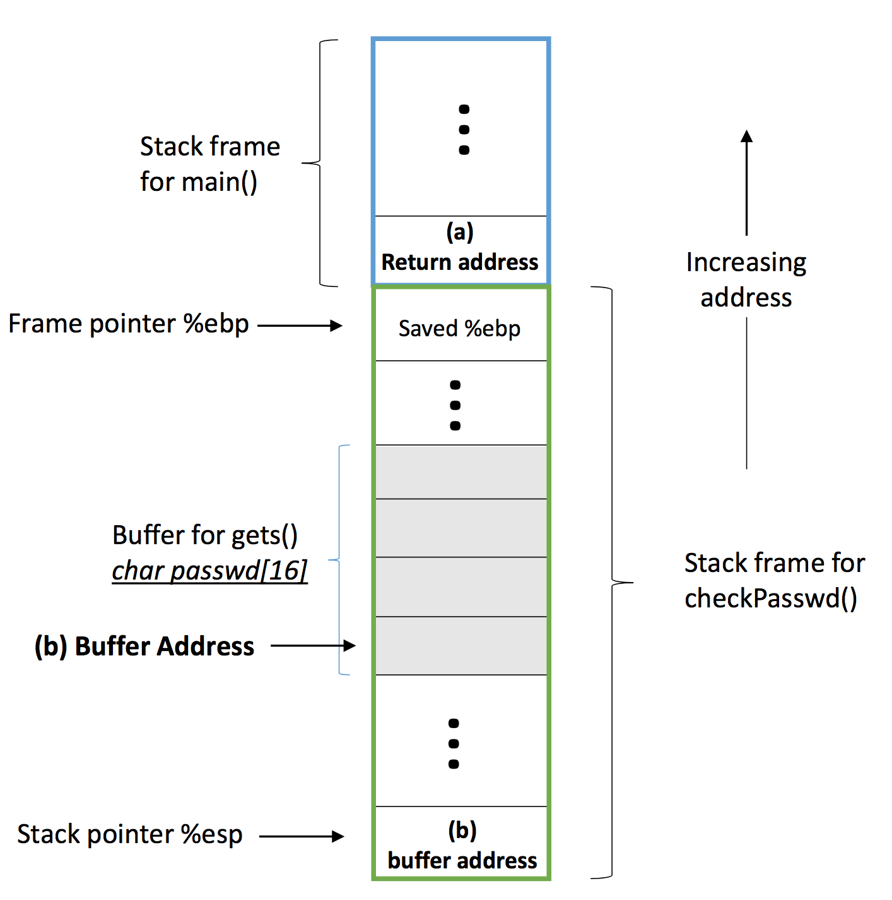

Recall that the gets() function has no bound checking, and it will read what we input in a line to `char passwd[16]` buffer in `checkPasswd()`'s stack frame no matter how long the input is. So, assume our input is longer than the size of the buffer so that the **return address** of `main()` procedure's stack frame is overwritten as the address of `granted()` function:

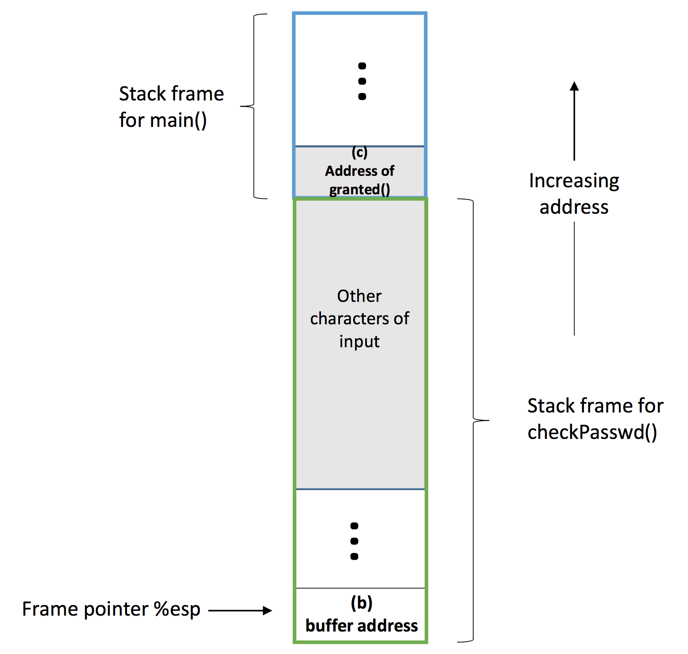

Then when the checkPasswd() function returns, the _ret_ instruction will pop the address of granted() function to %eip, and the granted() function will be invoked despite the password is correct or not. Now we know the method to hack the program _**overflow**_. In order to really do that, we actually need to know:

(a): The **return address** of main() after checkPasswd() returns.

(b): The buffer address on the stack.

(c): The address of the granted() function.

The information above can be obtained by using GDB on the _**overflow**_ executable.

## Hacking with GDB


An interesting **challenge** is:&#x20;

You will watch the demonstration of this lab and then find the correct address yourself (the address in the document **may not necessarily be** the address in your actual operation).

However, I give you guys <mark style="color:green;">**hints**</mark>**&#x20;about the address,** so read the doc carefully!


Let's start with getting (a) the **return address** of `main()` after `checkPasswd` returns, which the _call_ instruction will push to the stack when calling the `checkpasswd()` function.

1\) `gdb ./overflow`

2\) First read the assembly code of _**overflow**_'s main() function by `disassemble main`

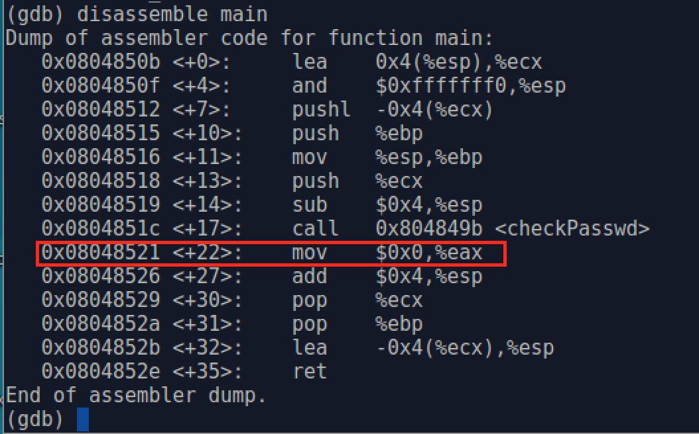

In the output, there are two parts delimited by a colon, the left part is the address of the assembly instruction, the number in the angle brackets is the offset from the beginning of the function; and the right part is the corresponding assembly instruction. We see from the figure that after the `checkPasswd()` function returns, the execution will continue the `mov` instruction. So **0x08048521** would be the **return address** that we would like to overwrite. _(**Hint**: in your implementation, the address may be <mark style="color:green;">0x080492bf</mark>)._

Now, we read the assembly code of `checkPasswd()` function in order to get (c).&#x20;

<figure>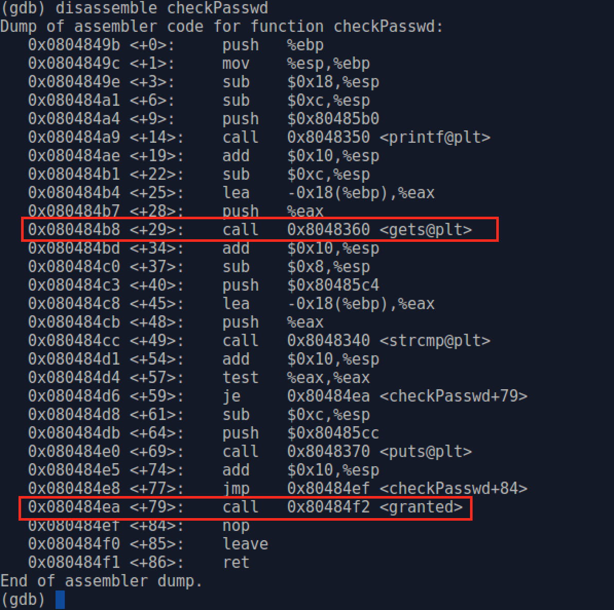<figcaption></figcaption></figure>

Here, we get the address of `granted()` function `call 0x80484f2 <granted>` is **0x080484ea**. _(**Hint**: in your implementation, the address may be <mark style="color:green;">**0x0804925b**</mark>)._

Finally, in order to get (b), the buffer address on the stack, we set a breakpoint at address **0x080484b8** _(**Hint**: in your implementation, the address may be <mark style="color:green;">**0x08049225**</mark>)_, where calling C standard library `gets()` function `call 0x8048360 <gets@plt>`. It is a relocation placeholder that will be replaced by the program loader since gets() is a function in the shared library. In order to set a breakpoint at a specific memory address, we can use `break *` followed by a memory address.

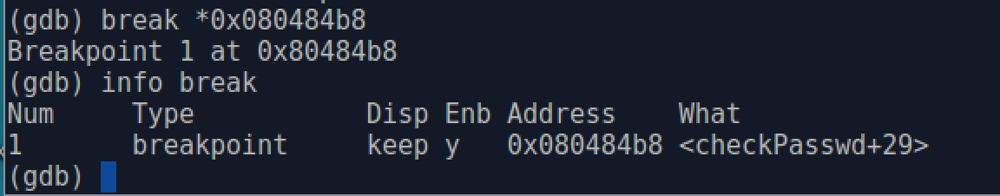

After setting the breakpoint, we <mark style="color:red;">**use the**</mark><mark style="color:red;">**&#x20;**</mark><mark style="color:red;">**`run`**</mark><mark style="color:red;">**&#x20;**</mark><mark style="color:red;">**command to start the**</mark><mark style="color:red;">**&#x20;**</mark>_<mark style="color:red;">**overflow**</mark>_<mark style="color:red;">**&#x20;**</mark><mark style="color:red;">**program,**</mark> and it will pause at the breakpoint we set before. Here, we use the `x`  command to print the content of the stack: `x/20x $esp` means we list 20 double-word data from the top of the stack.&#x20;

<figure>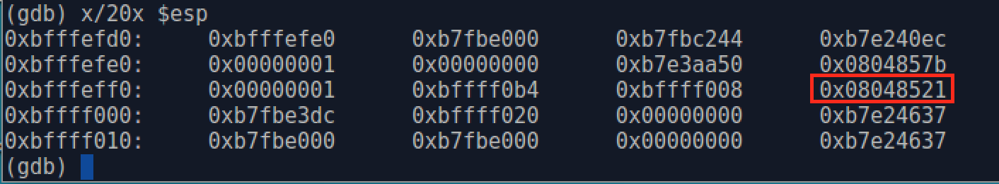<figcaption></figcaption></figure>

In the output, there are 5 lines, each line can be divided into two parts with a colon, the right part is 4 two-double values in hex format, and the left is the data's address within the same line. For example, we can easily know that the address of the first double word in the second line is **0xbfffefe0**. And then we find the **return address**(**0x08048521**) is pushed inside the stack with address **0xbfffeffc**.

Then we use the `nexti` command to step one instruction but not step into the `gets()` function. Then **overflow** program asks us to enter the password. After entering a sequence of characters "BBBBCCCC"(four 'B's + four 'C's, '0x42' and '0x43' denote 'B' and 'C' respectively in the hex system), we `x/20x $esp` again. The characters overwritten the memory space which is in two green rectangles.

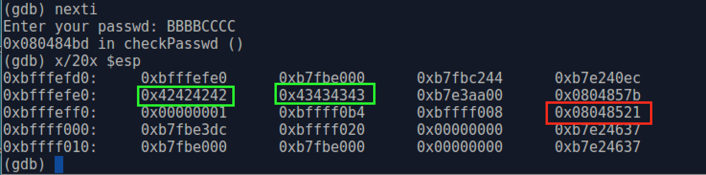

Till now, we can know (b) buffer address on the stack, which is **$0xbfffefe0**, and it is obvious that the buffer grows from a low memory address to a high memory address. The figure below shows the stack structure after entering 'BBBBCCCC'.

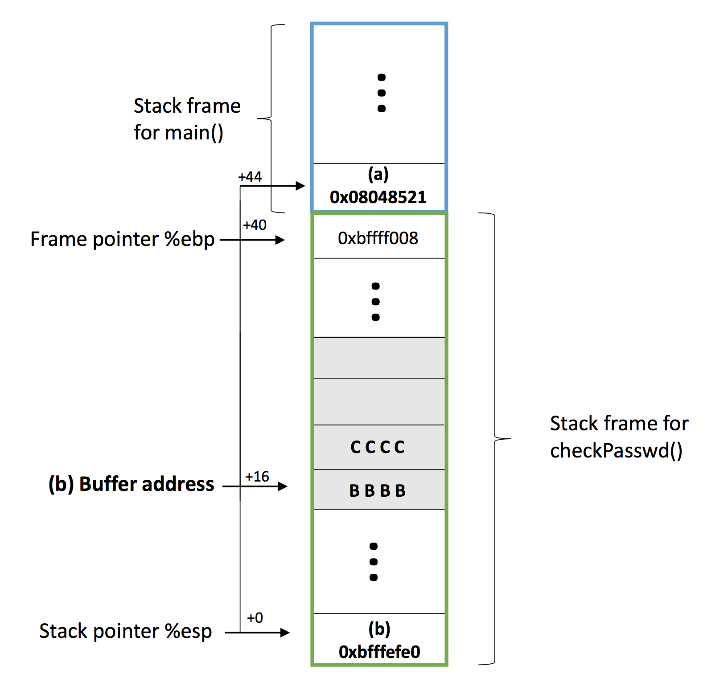

So, if we want to overwrite (a) **0x08048521** with (c) **0x080484ea**, we need to construct a sequence of 32(**0xbffff000** - **oxbfffefe0**) characters(bytes), in which the last 4 characters combined should equal (c) **0x080484ea** to overwritten (a) **0x08048521**, and we choose 28 'C' for the rest characters. Then we can see the stack frame structure as follows.

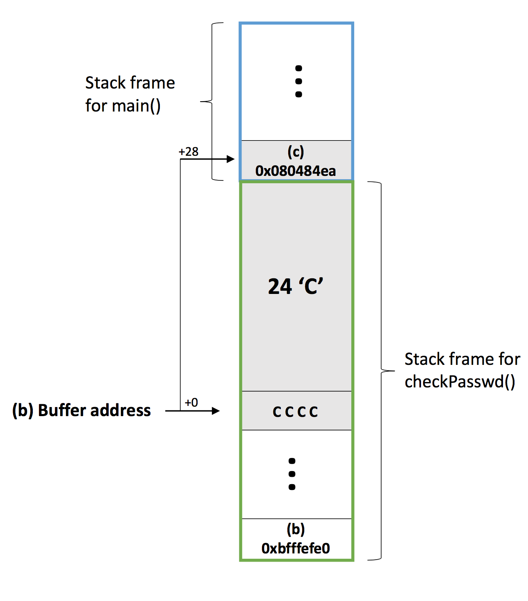

For convenience, we can use the following command in the terminal to generate 32 characters into a file named _attack.txt_.

```bash
python3 -c 'import sys; sys.stdout.buffer.write(b"C"*28 + b"\xea\x84\x04\x08") ' > attack.txt
```

Note that we input the bytes of **0x080484ea** inversely because our platform is based on a little-endian Intel processor. _**(Hint: also change the address, maybe&#x20;**<mark style="color:green;">**0x0804925b**</mark>**? (i.e.**_ `\x5b\x92\x04\x08`_**)).**_

With everything ready, we now can enter `./overflow < attack.txt` and gain privileges without knowing the real password.

<figure><figcaption><p>hacking done!</p></figcaption></figure>
